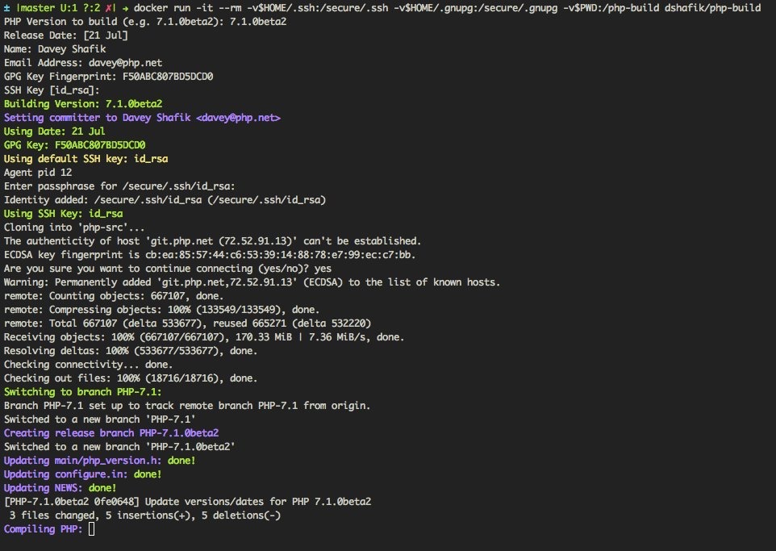

# PHP Release Builder

This is an attempt to standardize and automate most of the build process for PHP releases.

This container is currently based on `debian:jessie`.



It will do the following:

- Ask for inputs
  - Build version
  - Build date (for NEWS file)
  - Committer name & email
  - GPG Key fingerprint
  - SSH Key path
- Clone PHP from the official repo
- Create the release branch from the correct branch
- Update the version number/date in various files
- Build PHP
- Compare the build `-v` version against the intended version
- Run tests
- Tag the release, signed with your GPG key
- Push the tag and branches to origin
- Create the packages
- Generate GPG signatures & MD5 checksums
- Copy the resulting files to the docker host

## Features

- Repeatable, system independent builds
- Configuration file for quicker/easier builds
- Ability to rebuild using release branch
- Change verification

## Running the Container

**You must run this container interactively.** In addition to the above inputs you will be asked for your
ssh key passphrase, and your gpg key passphrase numerous times.

You need to mount three host directories and one file into the container at the following mount points:

1. `/secure/.ssh`: A directory containing the SSH key you need for git access
2. `/secure/.gnupg`: A directory containing your GPG keys
3. `/secure/config.env`: Your build configuration settings, use `config.env.default` as a template
4. `/php-build`: A directory where the resulting packages/signatures will be saved

As an example, to run it using the default locations for SSH keys, and GPG keys:

```sh
docker run -it --rm \
  -v$HOME/.ssh:/secure/.ssh \
  -v$HOME/.gnupg:/secure/.gnupg \
  -v$HOME/.php/config.env:/secure/config.env \
  -v$PWD:/php-build \
  dshafik/php-build
```

This will pull the image from hub.docker.com and run it.

## Building the Container

If you want to build the container yourself, you can rebuild using the following command:

```sh
docker build -t $USER/php-build .
```

To use your build, call the `docker run` command above with `$USER/php-build` rather than `dshafik/php-build`

## GnuPG version 2.1

GnuPG >= 2.1 use a key format which is incompatable with earlier versions
and appears to be incapable of downgrading gpg2.1 keys.
Meanwhile, Debian 8 happens to ship with GnuPG 1.4,
so you may need to create a new key.

Check for ~/.gnupg/{pub,sec}ring.gpg to determine if
you have a GnuPG v1 key available.
